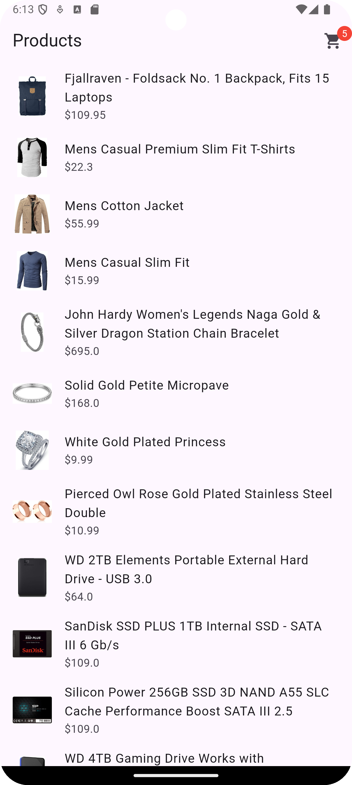
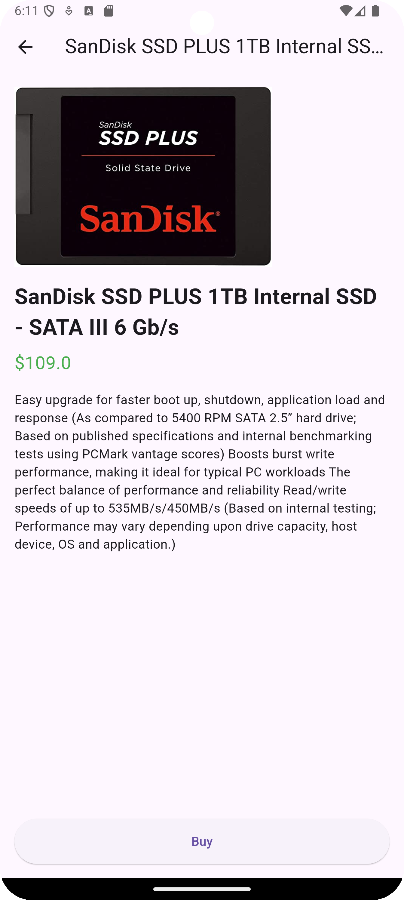
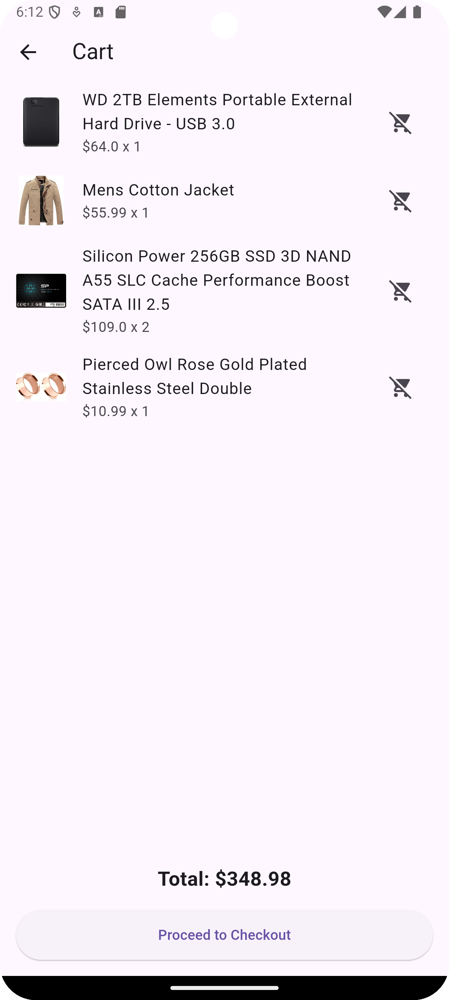

# Flutter Shopping Cart App with Riverpod

This is a Flutter application that demonstrates how to build a simple shopping cart using the Riverpod state management package. The app fetches product data from the Fake Store API and allows users to view product details, add products to the cart, and see the total cost of items in the cart.

## Features

- Fetch products from [Fake Store API](https://fakestoreapi.com/)
- Display a list of products with images, titles, and prices
- Navigate to a product detail page with a "Buy" button
- Add products to a shopping cart
- Display the total number of items in the cart on the app bar
- View the shopping cart with a summary of the total cost
- Remove items from the cart

## Screenshots

### Product List


### Product Detail


### Shopping Cart


## Getting Started

### Prerequisites

Ensure you have the following installed on your machine:

- [Flutter SDK](https://flutter.dev/docs/get-started/install)
- [Dart SDK](https://dart.dev/get-dart)

### Installation

1. **Clone the repository:**

   ```bash
   git clone https://github.com/your-username/flutter-shopping-cart.git
   cd flutter-shopping-cart
